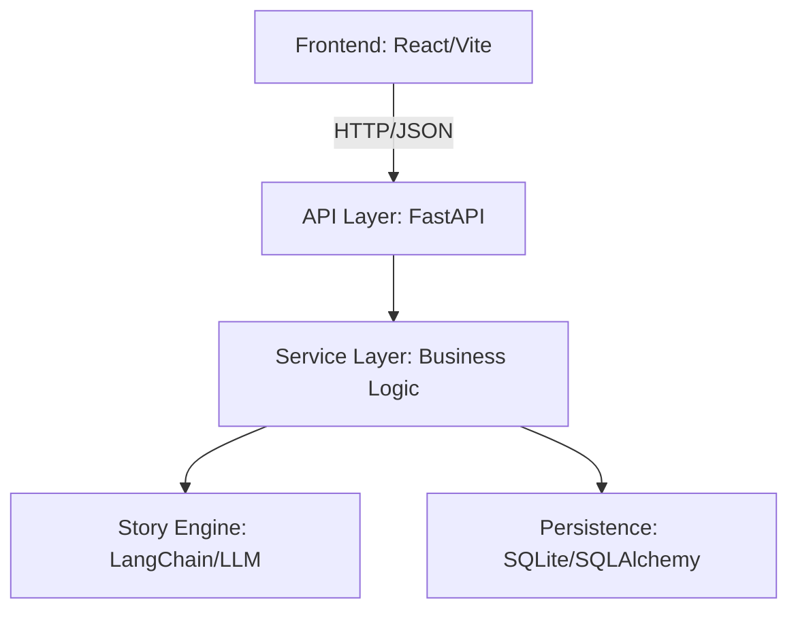

# 📖 Generate Adventure Story AI

[]()
[]()
[]()
[]()

**Generate Adventure Story with AI** is an interactive storytelling platform for children. Leveraging the power of **LLMs**, it puts kids in the director's chair, allowing them to define the initial setting and influence the narrative arc through real-time, step-by-step choices.

---

## 🏗 System Architecture

The project follows a clean, layered architecture to ensure separation of concerns and maintainability.



---

## 🛠 Tech Stack
- **Frontend:** React (Vite), Axios, CSS Modules
- **Backend:** FastAPI, Python 3.13, Pydantic
- **AI/ML** LangChain, OpenAI 
- **Database:** SQLite, SQLAlchemy (ORM)
- **Middleware:**	SlowAPI (Rate Limiting)

---

## ✨ Key Features
- **Interactive Branching Narrative:** Users make choices that dynamically alter the story path using AI/LLMs.
- **Robust API Design:** Built with FastAPI, featuring automated Swagger and Scalar documentation for easy integration and testing.
- **Production-Ready Patterns:** Implements robust **rate limiting** (5 req/min) using SlowAPI to manage API costs and prevent abuse.
- **Type Safety:** Full use of Pydantic schemas for clear, validated request/response contracts.
- **Developer Friendly:** Organized as a **monorepo** with clear separation between frontend logic and backend infrastructure.

---

## 📂 Overall Project Structure
This repository is organized as a **monorepo**, with clear separation between the **backend** and the **frontend** API consumer.

```plaintext
generate-adventure-story-ai/
├─ backend/
├─ frontend/
├─ .gitignore
└─ README.md
```

---

# 🚀 Getting Started
**Prerequisites**
- **Python 3.13**
- **Node.js 20+** & npm
- **Git**

---

### 1. Clone the Repository

```bash
git clone https://github.com/your-username/generate-adventure-story-ai.git
cd generate-adventure-story-ai
```

---

### 2. Create backend/.env file
```bash
DATABASE_URL=sqlite:///./database.db
API_PREFIX=/api
DEBUG=True
ALLOWED_ORIGINS=https://localhost:3000,https://localhost:5173
OPENAI_SERVICE_URL=https://models.github.ai/inference
OPENAI_API_KEY=
OPENAI_MODEL=gpt-4o-mini
```

---

### 3. Set Up the Backend
```bash
cd backend
pip install -r requirements.txt
# If you want to use the dev requirements instead:
# pip install -r requirements-dev.txt
python main.py
```

---

### 4. Set Up the Frontend
```bash
cd frontend
npm install
npm run dev
```

---

### 5. Access the Application
- **Frontend:** → `http://localhost:5173`  
- **Swagger Docs:** → `http://localhost:8000/swagger`  
- **Scalar UI:** → `http://localhost:8000/scalar`  

---

# 🗺️ Future Roadmap
- **Dynamic Rate Limit:** Allow the rate limit to be dynamically configured via environment variables.
- **Improved Testing:** Add more robust unit and integration tests (coverage and scope).
- **User Authentication:** Implement user accounts to allow users to save and revisit their favorite adventures.
